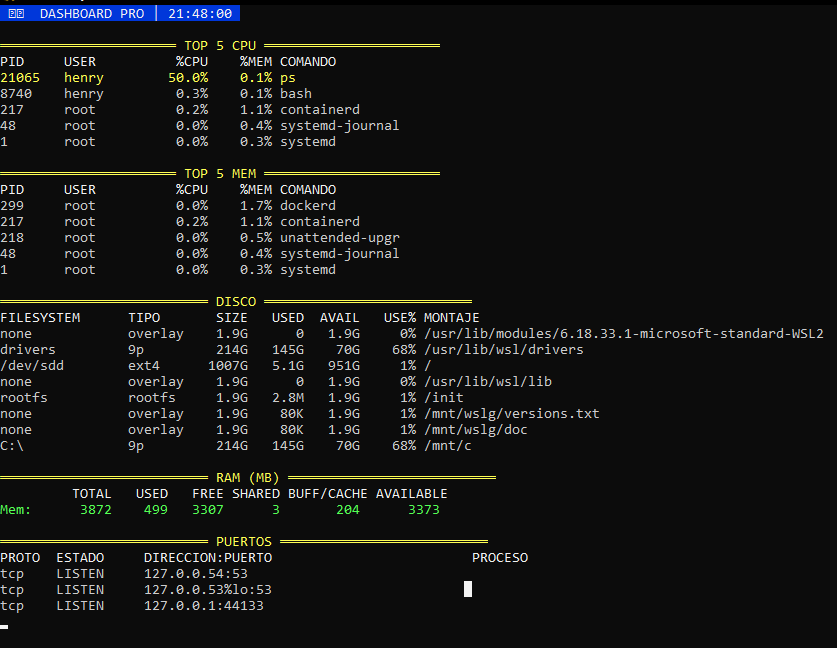

# 🖥️ Linux Monitoring Dashboard

A lightweight **real-time Linux monitoring dashboard** built with **Bash** using native Linux commands.

This project demonstrates how to monitor system resources directly from the terminal without installing additional monitoring tools. It is designed as a hands-on DevOps and Linux administration exercise.

---

## 📸 Screenshot

> Replace the image below with your own screenshot after uploading `screenshot.png` to this repository.



---

## ✨ Features

- 🔥 Displays the Top 5 CPU-consuming processes
- 🧠 Displays the Top 5 Memory-consuming processes
- 💾 Shows disk usage for mounted filesystems
- 📊 Displays RAM utilization
- 🌐 Lists listening TCP/UDP ports
- 🎨 Color-coded output based on resource usage
- 🔄 Automatic refresh every 5 seconds
- ⚡ Built using only native Linux commands

---

## 🛠️ Technologies

- Bash
- Linux
- AWK
- ps
- df
- free
- ss

---

## 📋 Commands Used

| Command | Purpose |
|----------|---------|
| `ps` | Display running processes |
| `df` | Show disk usage |
| `free` | Display memory usage |
| `ss` | List listening network ports |
| `awk` | Format and process command output |
| `sleep` | Refresh dashboard every 5 seconds |
| `clear` | Refresh terminal screen |

---

## 🚀 Getting Started

### Clone the repository

```bash
git clone https://github.com/your-username/linux-monitoring-dashboard.git
cd linux-monitoring-dashboard
```

### Make the script executable

```bash
chmod +x dashboard.sh
```

### Run

```bash
./dashboard.sh
```

---

## 📊 Dashboard Sections

- Top 5 CPU Processes
- Top 5 Memory Processes
- Disk Usage
- RAM Statistics
- Listening Network Ports

---

## 📁 Project Structure

```text
linux-monitoring-dashboard/
│
├── dashboard.sh
├── README.md
├── screenshot.png
└── LICENSE
```

---

## 🎯 Learning Objectives

This project helped me practice:

- Linux System Administration
- Bash Scripting
- Process Monitoring
- Resource Monitoring
- Terminal Formatting
- AWK Text Processing
- DevOps Fundamentals

---

## 🔮 Future Improvements

- CPU usage history
- Network traffic monitoring
- Docker container statistics
- System load average
- Disk I/O metrics
- Export metrics to CSV
- Interactive dashboard mode
- Log monitoring

---

## 🤝 Contributing

Suggestions and improvements are welcome.

Feel free to fork the repository, open an issue, or submit a pull request.

---

## 📄 License

This project is licensed under the MIT License.

---

## 👨‍💻 Author

**Henry Joseph Calani**

DevOps | Linux | Automation | Cloud | Bash

If you found this project useful, consider giving it a ⭐ on GitHub.
If you found this project useful, consider giving it a ⭐ on GitHub.